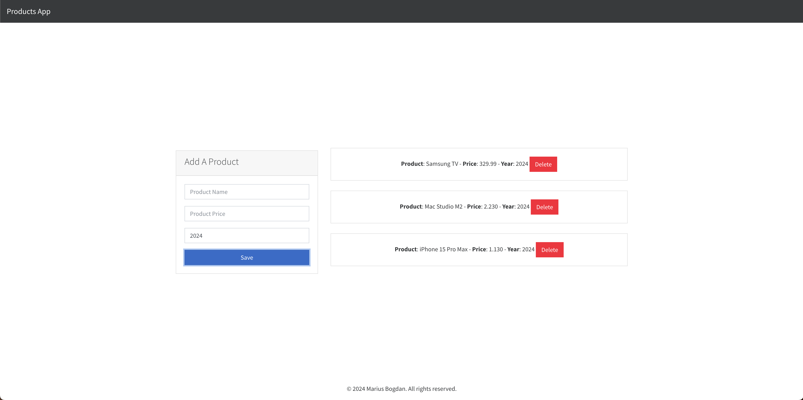

# Add a Product


[](#)


> A simple product management application that allows users to add, view, and remove products.

## Overview
**Add a Product** is a lightweight web application that enables users to add products by entering their name, price, and year of release. Users can view the products in a list and remove them easily. Built using HTML, CSS, and JavaScript, this app provides a minimal and user-friendly experience for product management.

## Preview

<p align="center">
  
</p>

## Features
- **Product Addition:** Users can enter a product name, price, and release year.
- **Dynamic Product List:** Displays added products in a structured list format.
- **Delete Functionality:** Users can remove products with a single click.
- **Minimal UI:** A simple and intuitive interface for ease of use.


## Live Demo
**Explore the live version here:** [View Live Demo](https://marius-bogdan.com/projects/add-a-product/)

## Local Setup
1. **Clone** the repository:
   ```bash
   git clone https://github.com/MIBogdan/add-a-product.git
   ```
2. **Open** the `index.html` file in your browser
   *- or use a local development server (like VS Code Live Server) for a smoother development experience.*


---

## Author
**Marius Bogdan**  
[Personal portfolio](https://marius-bogdan.com/)

Feel free to reach out for any questions or collaborations!

## License

This project is provided for testing and demonstration purposes only. All rights are reserved. No part of this project may be redistributed, reuploaded, or used in any manner (commercially or otherwise) without explicit written permission from the author.
